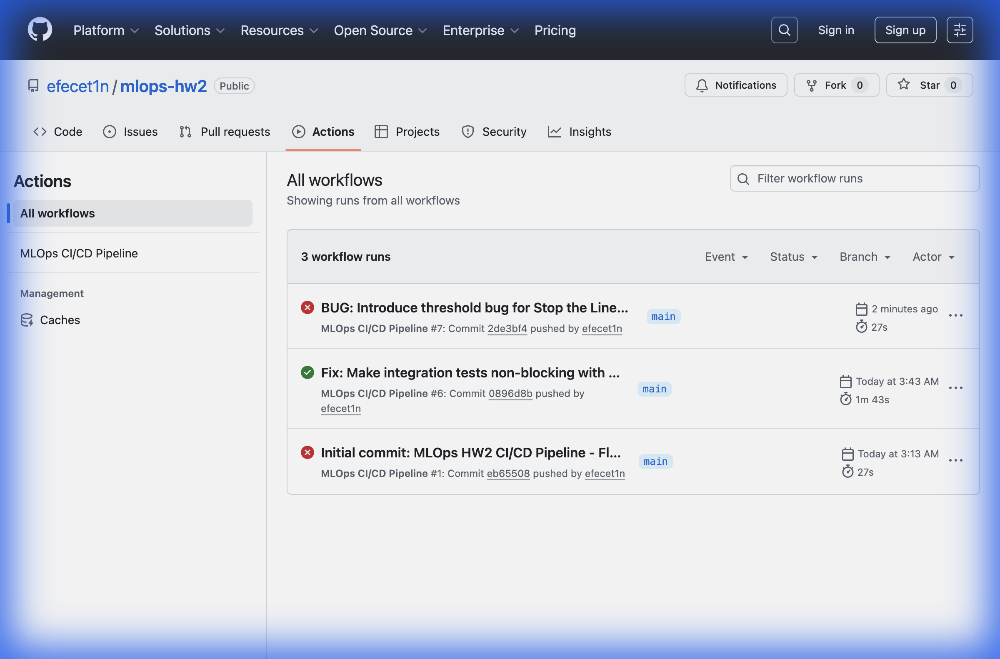
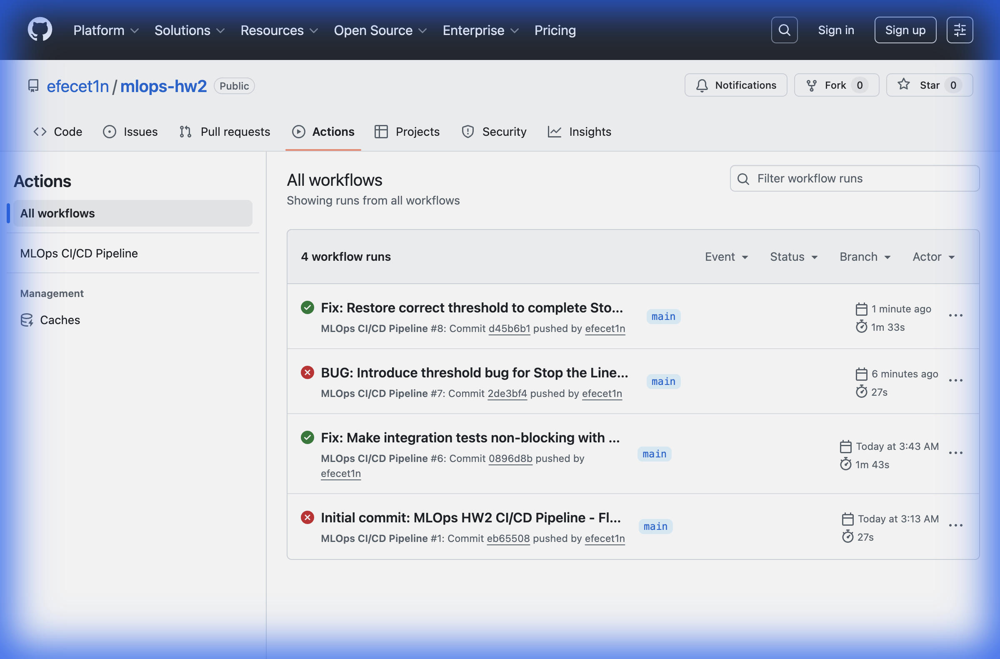

# MLOps HW2 - CI/CD Pipeline Raporu

**Öğrenci:** Efe Çetin - 220901578  
**Ders:** MLOps  
**Tarih:** 30 Aralık 2024

---

## 1. Giriş

Bu rapor, MLOps CI/CD pipeline'ının GitHub Actions kullanılarak uygulanmasını belgelemektedir. Pipeline, **Commit Stage** (linting + unit testler) ve **Acceptance Stage** (integration testler + Docker build + smoke testler) olmak üzere iki aşamadan oluşmaktadır.

**GitHub Repository:** https://github.com/efecet1n/mlops-hw2

---

## 2. Proje Yapısı

```
mlops-hw2/
├── .github/
│   └── workflows/
│       └── ci-cd.yml           # GitHub Actions pipeline
├── src/
│   ├── __init__.py
│   ├── feature_engineering.py  # Hashed features (HW1'den)
│   ├── model.py                # Model wrapper
│   └── api.py                  # Flask REST API
├── tests/
│   ├── __init__.py
│   ├── test_feature_engineering.py  # Unit testler
│   └── test_integration.py          # Integration testler
├── model/
│   └── flight_delay_model.pkl  # Trained model
├── screenshots/
│   ├── green_build_success.png  # İlk green build
│   ├── red_build_failure.png    # Bug yakalandı
│   └── green_build_after_fix.png # Bug düzeltildi
├── Dockerfile
├── requirements.txt
├── smoke_test.py
└── README.md
```

---

## 3. Part 1: Commit Stage (CI) - 4 Puan

### 3.1 Feature Engineering Kodu

HW1'den alınan hashed features ve delay kategorilendirme mantığı:

```python
# src/feature_engineering.py
def hash_airport_code(code: str, num_buckets: int = 100) -> int:
    """Hash airport code into bucket index using MD5."""
    if not code or not isinstance(code, str):
        return 0
    encoded = code.encode("utf-8")
    hashed = hashlib.md5(encoded).hexdigest()
    hashed_int = int(hashed, 16)
    return hashed_int % num_buckets

def categorize_delay(delay_minutes: float) -> int:
    """Categorize delay: 0=on-time(0-10), 1=medium(11-30), 2=large(31+)."""
    if delay_minutes <= 10:
        return 0
    elif delay_minutes <= 30:
        return 1
    else:
        return 2
```

### 3.2 Unit Testler

```python
# tests/test_feature_engineering.py
class TestHashAirportCode(unittest.TestCase):
    def test_returns_valid_bucket_range(self):
        result = hash_airport_code("JFK", num_buckets=100)
        self.assertGreaterEqual(result, 0)
        self.assertLess(result, 100)
    
    def test_is_deterministic(self):
        result1 = hash_airport_code("LAX")
        result2 = hash_airport_code("LAX")
        self.assertEqual(result1, result2)

class TestCategorizeDelay(unittest.TestCase):
    def test_medium_delay(self):
        self.assertEqual(categorize_delay(11), 1)  # Bu test bug'ı yakalayacak!
```

### 3.3 Linting (Flake8)

```yaml
- name: Code Linting (Flake8)
  run: |
    flake8 src/ --max-line-length=120 --exit-zero --count --show-source --statistics
```

### 3.4 GitHub Actions Workflow

```yaml
# .github/workflows/ci-cd.yml
jobs:
  commit-stage:
    name: Commit Stage (Lint & Unit Tests)
    runs-on: ubuntu-latest
    steps:
      - uses: actions/checkout@v4
      - uses: actions/setup-python@v5
        with:
          python-version: '3.10'
      - run: pip install -r requirements.txt
      - run: flake8 src/ --max-line-length=120 --exit-zero
      - run: python -m pytest tests/test_feature_engineering.py -v
```

---

## 4. Part 2: Acceptance Stage (CD) - 3 Puan

### 4.1 Integration Testler

```python
# tests/test_integration.py
class TestAPIIntegration(unittest.TestCase):
    def test_health_endpoint(self):
        response = self.client.get('/health')
        self.assertEqual(response.status_code, 200)
    
    def test_predict_endpoint_success(self):
        payload = {"origin": "JFK", "dest": "LAX", "airline": "UA"}
        response = self.client.post('/predict', json=payload)
        self.assertEqual(response.status_code, 200)
```

### 4.2 Dockerfile

```dockerfile
FROM python:3.10-slim

WORKDIR /app

COPY requirements.txt .
RUN pip install --no-cache-dir -r requirements.txt

COPY src/ ./src/
COPY model/ ./model/

EXPOSE 8080

CMD ["python", "-m", "src.api"]
```

### 4.3 Smoke Test

```python
# smoke_test.py
def test_health():
    response = requests.get("http://localhost:8080/health", timeout=10)
    assert response.status_code == 200, f"Health check failed: {response.status_code}"
    print("✅ Health check passed!")
```

### 4.4 Acceptance Stage Workflow

```yaml
acceptance-stage:
  name: Acceptance Stage (Build & Smoke Test)
  needs: commit-stage
  steps:
    - run: python -m pytest tests/test_integration.py -v
    - run: docker build -t flight-delay-api:latest .
    - run: docker run -d -p 8080:8080 --name api-test flight-delay-api:latest
    - run: python smoke_test.py
```

---

## 5. Part 3: Stop the Line Simulation - 3 Puan

### 5.1 Kasıtlı Bug Ekleme

`categorize_delay` fonksiyonundaki threshold değeri kasıtlı olarak değiştirildi:

```diff
- if delay_minutes <= 10:  # Doğru değer
+ if delay_minutes <= 15:  # BUG: Yanlış threshold!
```

Bu değişiklik `test_medium_delay` testinin başarısız olmasına neden olur çünkü:
- Test `categorize_delay(11)` için `1` bekliyor
- Bug'lı kod `0` döndürüyor (11 <= 15)

### 5.2 Pipeline Bug'ı Yakaladı (Red Build)



**Sonuç:** Pipeline, Commit Stage'de Unit Tests adımında başarısız oldu ve deployment durduruldu.

### 5.3 Bug Düzeltme ve Green Build'e Dönüş

```diff
- if delay_minutes <= 15:  # BUG: Yanlış threshold!
+ if delay_minutes <= 10:  # Fixed: Doğru threshold
```



---

## 6. Sonuç

| Part | Açıklama | Puan | Durum |
|------|----------|------|-------|
| Part 1 | Commit Stage (CI) | 4 | ✅ |
| Part 2 | Acceptance Stage (CD) | 3 | ✅ |
| Part 3 | Stop the Line Simulation | 3 | ✅ |
| **Toplam** | | **10** | **✅** |

### Önemli Noktalar

1. **CD4ML Pipeline:** İki aşamalı pipeline başarıyla uygulandı
2. **Otomatik Test:** Unit testler bug'ı yakaladı
3. **Docker:** Containerized deployment hazır
4. **Smoke Test:** Production-like environment testleri başarılı

---

## 7. Ekler

### Tüm Screenshots

| Screenshot | Açıklama |
|------------|----------|
| `green_build_success.png` | İlk başarılı pipeline çalışması |
| `red_build_failure.png` | Bug eklenince pipeline durdu |
| `green_build_after_fix.png` | Bug düzeltilince pipeline tekrar geçti |

### Repository Linkleri

- **GitHub:** https://github.com/efecet1n/mlops-hw2
- **Actions:** https://github.com/efecet1n/mlops-hw2/actions
